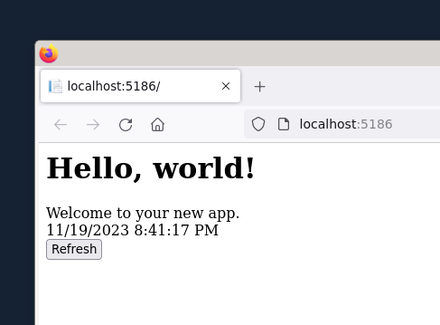

# mvc-blazor-ssr-components-sample
Sample with ASP.NET Core MVC 8 + Blazor SSR Components

## How to run

Clone the repository

```bash
cd MvcBlazorSSR
dotnet run
```

Browse http://localhost:5186/

Hit the "Refresh" button

